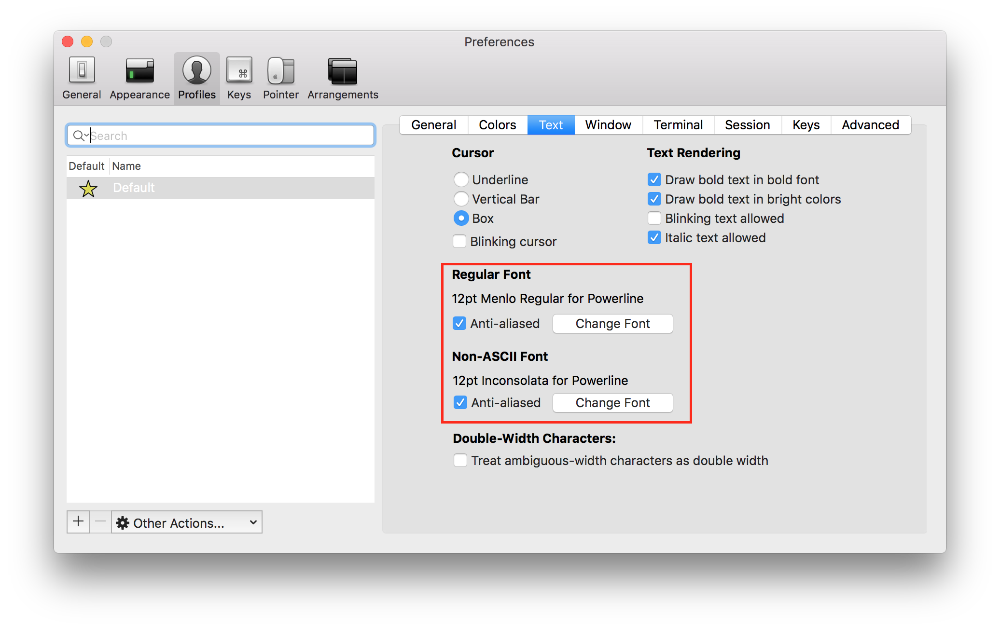

## 개발환경 세팅


Mac을 쓰는 개발자라면 좀 더 개발자(?)답게 보이기 위해서 콘솔창을 위와 같이 만드는것은 한번 해볼만 하다.
Git을 사용하기 전까지는 몰랐는데 Git을 사용하고 나니 **정말 편하다** 왜 모든 개발자들이 위와같이 세팅을 하는지 알거 같다.

**Mac에서의 설치과정만 소개할 예정이다.**

세팅 순서는 아래와 같이 진행하겠다.<br>
1. zsh 설치<br>
2. oh-my-zsh 설치<br>
3. agnoster & solarized theme 적용


## zsh 설치

지금 부터 설명하는 세팅들은 iTerm이 설치되어있다는 전제하에 진행한다.

iTerm을 깔지 않았다면 [iTerm](https://www.iterm2.com/downloads.html)에서 다운을 받기를 바란다.

일단 zsh가 깔려있는지 확인 하기 위해 아래와 같이 명령어을 입력해본다.
```
 zsh --version
```
위와 같이 입력했는데 zsh 버전이 안나온다면 아래와 같이 진행하면 된다.
```
 brew update 
 brew install zsh
```

기본쉘을 zsh쉘로 바꾸기 위해서는 아래와 같이 하면 된다.
```linux
  chsh -s `which zsh`     #기본셀을 zsh로 바꾼다
```

설치가 완료되면 터미널 종료 후 재시작을 해서 기본이 zsh인지 확인한다.

이 zsh 장점은 `강력한 tab-completion` 이다. 설치해보고 몇번 써보면 바로 실감할것이다


## oh-my-zsh 설치

[oh-my-zsh](https://github.com/robbyrussell/oh-my-zsh)를 참고한다.

이 과정은 `git`이 설치되어 있다는 전제하에 진행된다.

아래와 같이 command-line을 쳐준다.

```
sh -c "$(curl -fsSL https://raw.githubusercontent.com/robbyrussell/oh-my-zsh/master/tools/install.sh)"
```

## agnoster & solarized theme 적용

[solarized](http://ethanschoonover.com/solarized)사이트에 있는 theme를 적용할것이다.

적당한 경로를 잡은 후에 아래 명령으로 clone을 한다.

```
cd dev-setting  # 임의로 정한 경로
git clone git://github.com/altercation/solarized.git
```

clone한 폴더에 있는 파일을 iterm theme로 import 할 것이다.


`iTerm -> Preferences -> profiles`로 이동 한 후 `import`를 누른다.

import 할 파일은 위에 그림에 있는 `Solarized Dark.itermcolors`이다.

그리고 `agnoster theme`를 사용하기 위해서는 **iTerm text Font를 아래와 같이 바꿔줘야 한다.**



[Font](https://gist.github.com/qrush/1595572) 주소로 가서 상단의 2개 폰트에 대해서 설치한다.

폰트까지 모두 변경하였으면 echo로 아래와 같이 쳤을때 그림과 같은 결과가 나와야 한다.

`echo "\ue0b0 \u00b1 \ue0a0 \u27a6 \u2718 \u26a1 \u2699"`


위와 같이 나온다면 축하한다! 이 세팅과정중에 90%는 한거다.

그러고 나서 `cd ~`로 이동 후 `vim .zshrc`로 들어가서 테마를 변경해준다.

```
"ZSH-THEHE = "robbyrussell"
ZSH-THEHE = "robbyrussell"
```

터미널을 종료 후 git 폴더로 들어가면 맨 처음과 같은 화면이 뜰거다.

여기까지 따라오느냐고 수고했다. 박수 세번(짝)(짝)(짝)

**인제 열심히 코딩 후 git에 commit하자**
